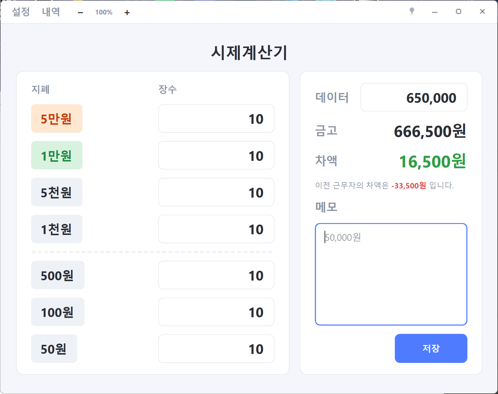
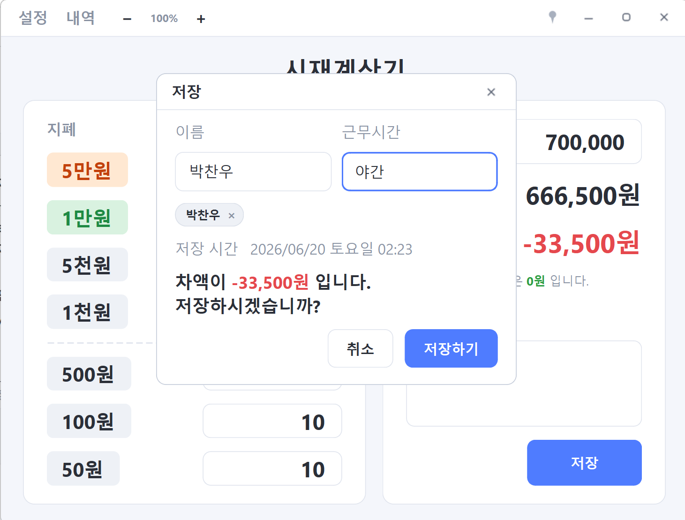
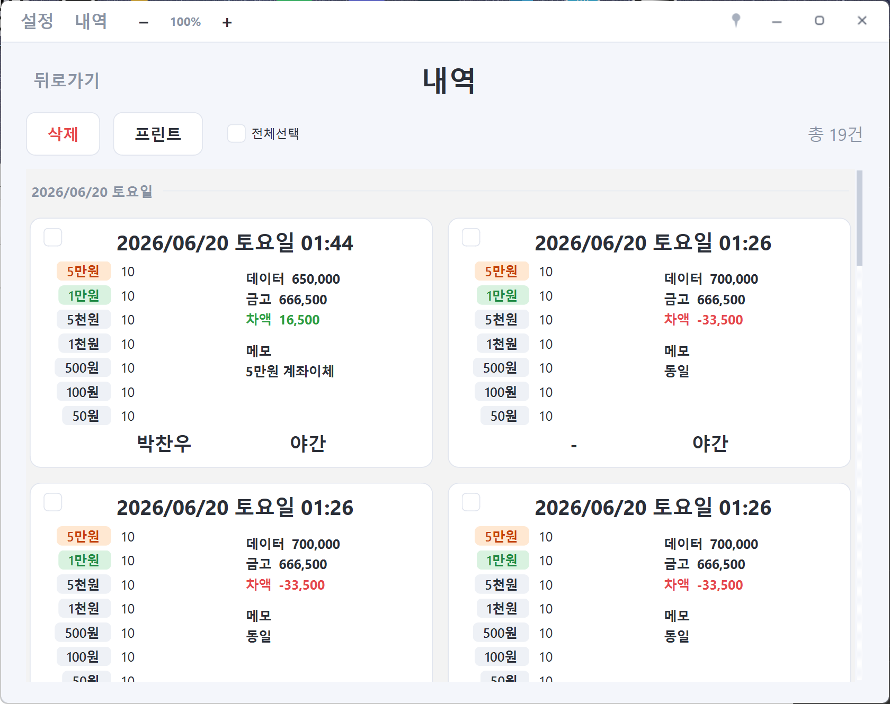
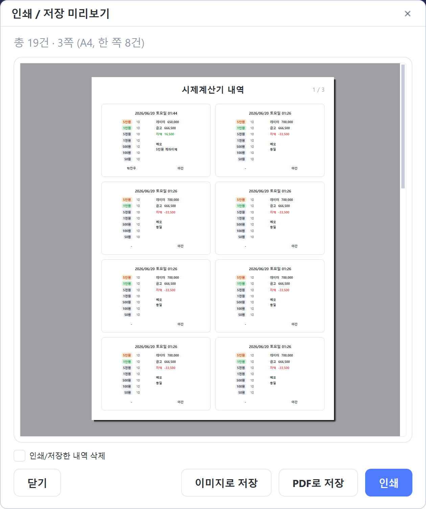
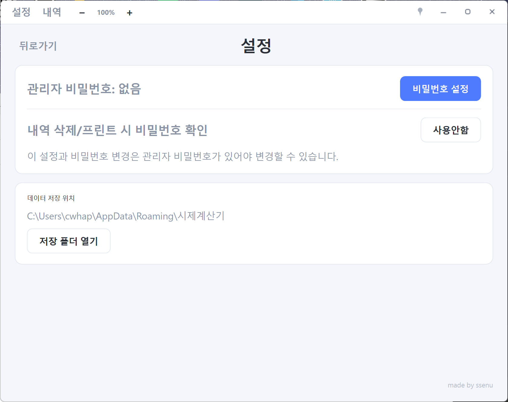

# 💵 시재계산기

매장·카페에서 **근무 교대 시 현금 시재를 빠르고 정확하게 점검**하는 Windows 프로그램입니다.
지폐·동전 매수만 입력하면 금고 금액과 차액이 자동으로 계산되고, 기록을 저장·인쇄할 수 있습니다.
24시간 켜두는 매장 PC에서도 안정적으로 동작하도록 만들어졌습니다.

<p align="center">
  
</p>

---

## ⬇️ 다운로드 (설치 불필요)

### **[👉 시재계산기.zip 다운로드](https://github.com/ssenu/priceCalculator/raw/main/release/시재계산기.zip)**

1. 위 링크를 눌러 `시재계산기.zip` 을 내려받습니다.
2. 받은 zip을 **압축 풀기** → 안에 있는 `시재계산기.exe` 를 **더블클릭하면 실행**됩니다. (설치 과정 없음)
3. 실행 시 *"Windows의 PC 보호"* 파란 창이 뜨면 **추가 정보 → 실행**을 눌러 주세요.
   (개인이 만든 서명 없는 프로그램이라 나타나는 정상 안내입니다.)

> 원하는 폴더(또는 바탕화면)에 두고 써도 되고, 기록은 자동으로 안전한 위치에 저장됩니다.

<details>
<summary>⚠️ 다운로드가 "바이러스 감지"로 차단되나요?</summary>

직접 `.exe` 를 받으면 브라우저(크롬/엣지)나 백신이 **오탐(false positive)** 으로 차단할 수 있습니다.
이 프로그램은 PyInstaller로 만든 서명 없는 실행 파일이라 생기는 흔한 현상이며 바이러스가 아닙니다.

**해결: 위의 `.zip` 으로 받으세요.** zip은 대부분 차단 없이 받아지고, 압축만 풀면 됩니다.
그래도 백신이 막으면 **다운로드 항목에서 "계속/보관"** 을 선택하거나, 해당 폴더를 백신 **예외(허용)** 에 추가하면 됩니다.

</details>

---

## 📖 사용 설명서

### 1) 메인 화면 — 시재 입력 & 자동 계산

<p align="center">
  
</p>

- 왼쪽에서 **지폐·동전별 매수(장수)** 를 입력하면, 오른쪽 **금고**(= 단위 × 매수 합계)가 자동으로 계산됩니다.
- **데이터** 칸에 POS 등 *있어야 할 금액* 을 입력하면 **차액(= 금고 − 데이터)** 이 자동 표시됩니다.
  - 돈이 **남으면 초록색**, **부족하면 빨간색** 으로 보여 한눈에 파악됩니다.
- **이전 근무자의 차액**이 함께 표시되어 인수인계가 편합니다.
- **메모**: 비워 두면 회색으로 추천값(이번 차액과 이전 차액의 차이, 같으면 "동일")이 자동으로 들어갑니다.
- 숫자는 **천 단위 콤마 자동**, `Tab`·`Enter` 로 다음 칸으로 빠르게 이동합니다.
- 상단의 **－ / ＋** 로 화면을 크게/작게(글자 확대) 조절할 수 있습니다.

### 2) 저장 — 이름 · 근무시간 기록

<p align="center">
  
</p>

- **저장** 버튼을 누르면 **이름**과 **근무시간**(오전·오후1·오후2·야간·사장님)을 선택해 기록합니다.
- **근무시간 기본값은 현재 시각대에 맞게 자동 선택**됩니다. (예: 새벽 → 야간)
- 자주 쓰는 **이름은 버튼(칩)으로 저장**되어 클릭 한 번으로 입력하고, 옆 **×** 로 삭제할 수 있습니다.
- 저장 시각은 자동으로 함께 기록되고, 차액이 얼마인지 확인 후 **저장하기** 를 누릅니다.

### 3) 내역 — 기록 보기 · 선택 삭제/인쇄

<p align="center">
  
</p>

- 저장한 기록을 **날짜별로 묶어 카드**로 보여줍니다. (최신순)
- 각 카드의 **체크박스**로 원하는 기록만 골라 **삭제** 하거나 **프린트** 할 수 있습니다.
- **전체선택** 으로 한 번에 모두 선택할 수도 있습니다.

### 4) 프린트 — 인쇄 / PDF / 이미지 저장

<p align="center">
  
</p>

- **미리보기**를 보면서 **A4 한 장에 8건씩** 깔끔하게 출력합니다.
- **인쇄**, **PDF로 저장**, **이미지(PNG)로 저장** 중 선택할 수 있습니다.
- *"인쇄/저장한 내역 삭제"* 를 체크하면 출력 후 해당 기록을 바로 정리합니다.

### 5) 설정 — 비밀번호 · 데이터 폴더

<p align="center">
  
</p>

- **관리자 비밀번호**를 설정하면, **내역 삭제·인쇄 시 비밀번호 확인**을 켤 수 있습니다. (실수/임의 삭제 방지)
- **데이터 저장 위치**를 확인하고 **저장 폴더 열기**로 바로 이동할 수 있습니다.

---

## 🧰 그 밖의 편의 기능

### 📌 항상 위에 고정 (고정핀)

창 **맨 위 오른쪽의 핀(📌) 버튼**을 누르면, 시재계산기 창이 **다른 모든 프로그램 위에 항상 떠 있게** 고정됩니다.

- POS·엑셀 등 다른 창을 켜도 시재계산기가 가려지지 않아, 보면서 입력하기 편합니다.
- 핀이 **회색이면 꺼짐**, **검은색이면 켜짐(고정 중)** 입니다. 다시 누르면 해제됩니다.

| 그 외 기능 | 설명 |
|------|------|
| ＋ / － | 화면(글자) 확대·축소, 창 크기도 함께 조절 |
| 키보드 | `Tab`/`Enter` 로 칸 이동, 메모에서 `Enter` 로 바로 저장 |
| 안전 저장 | 기록을 안전하게(원자적) 저장하고 자동 백업본 보관 |

---

## 💾 데이터 저장 위치 & 백업

모든 기록과 설정은 아래 폴더에 자동 저장됩니다. **이 폴더만 복사하면 백업**됩니다.

```
%APPDATA%\시재계산기\
```

- `records.json` — 시재 기록 (자동 백업 `.bak` 포함)
- `settings.json` — 비밀번호·화면 배율 등 설정

---

## 🛠 직접 빌드하기 (개발자용)

```bash
uv sync                 # 의존성 설치
uv run python main.py   # 실행
build.bat               # exe 빌드 → dist\시재계산기.exe
```

Python + PyQt6, PyInstaller(onefile)로 만들어졌습니다.

---

<p align="right"><sub>made by ssenu</sub></p>
